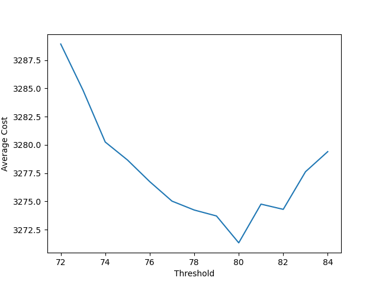
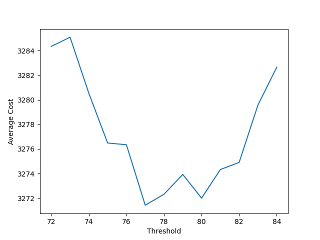
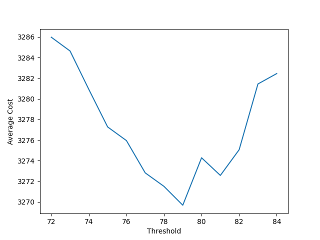
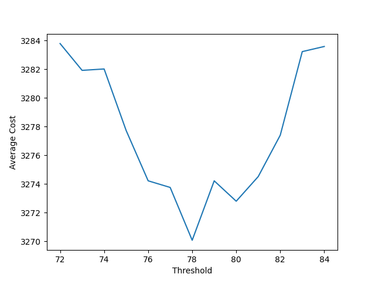

# Optimal Coin Expenditure for Mario Wonder Standees

This is a simple program to run monte carlo simulations based on probability estimations for each standee tier.

Buying only random standees with repeats yields roughly 2100 draws to successfully pull all 144 standees. At 10 coins per draw, that's 21000 coins. Given that a guaranteed new standee costs 30 coins, we can estimate how many true random draws should be purchased before switching to purchasing guaranteed standees to optimize coin expenditure.

Based on the simulations provided, random standees should be purchased until your collection contains roughly 78 to 80 standees. At this point, it's no longer financially advantageous to purchase random standees; guaranteed standees should be purchased instead. Total, you should expect to spend around 3272 coins.

Here are the relavent plots:

